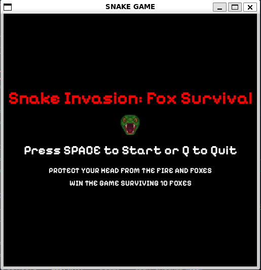
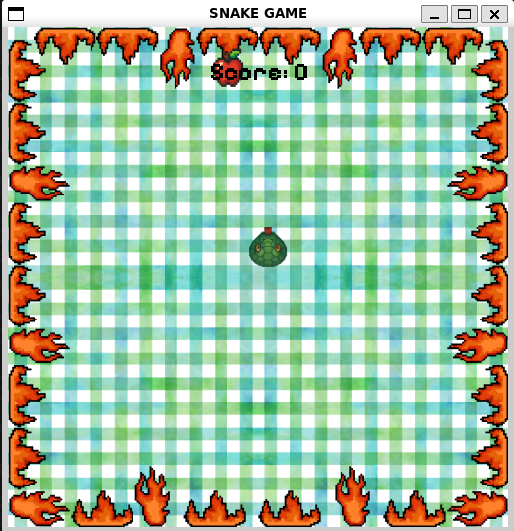
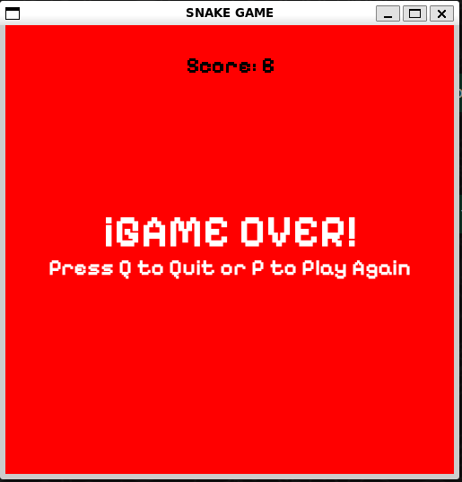
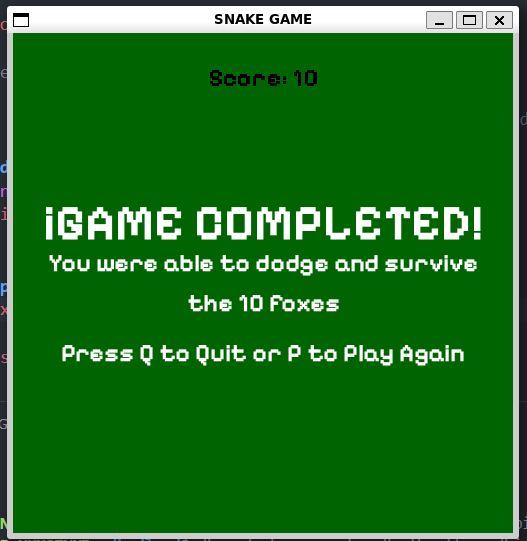

# Snake Invasion: Fox Survival Edition

Bienvenido a **Snake Invasion**, esta no es la clásica versión del juego de la serpiente. Es un desafío de supervivencia donde la estrategia y los reflejos son la clave para ganar.

Este proyecto fue desarrollado en **Python** utilizando la librería **Pygame** como parte de una resolución de prueba técnica.






## ¿Por qué es una versión diferente?

A diferencia del Snake tradicional, este juego introduce mecánicas de **gestión de enemigos** y un **objetivo final**:

* **Sistema de Victoria:** El juego no es infinito. Debes demostrar que puedes convivir y sobrevivir a una pantalla llena de **10 zorros** en movimiento.
* **Enemigos Dinámicos:** Los zorros aparecen progresivamente cada 10 puntos. Cada zorro tiene su propia trayectoria y velocidad, rebotando en las paredes.
* **Visuales Avanzados:** Cuerpo dinámico con piezas de giro (curvas).
    * Animación de la cabeza: abre la boca al detectar comida.
    * Efecto de "digestión": el cuerpo cambia visualmente cuando la comida pasa por él.
* **Items Especiales:** Aparición aleatoria de la "Python Apple" que otorga +5 puntos y crecimiento extra.

## Tecnologías Utilizadas

* **Lenguaje:** Python 3.12.3
* **Librería Principal:** Pygame: Manejo de gráficos, eventos y colisiones.
* **Lógica Matemática:** Uso de vectores y trigonometría para la rotación fluida de los sprites.

## Instrucciones de Juego

### Objetivo
Recolecta comida para crecer y ganar puntos. Por cada 10 puntos, un nuevo zorro entrará al bosque rodeado de llamas. Gana el juego llegando a la invasión máxima de 10 zorros sin chocar con ellos, con las paredes hechas fuego o contigo mismo.

### Controles
* **Moverse:** `FLECHAS` o teclas `W`, `A`, `S`, `D`.
* **Iniciar Juego:** Tecla `ESPACIO` en el menú principal.
* **Reiniciar:** Tecla `P` en la pantalla de Game Over/Victoria.
* **Salir:** Tecla `Q`.

## Cómo ejecutar el proyecto

1. Asegúrate de tener instalado Python y Pygame:
   ```bash
   pip install pygame
